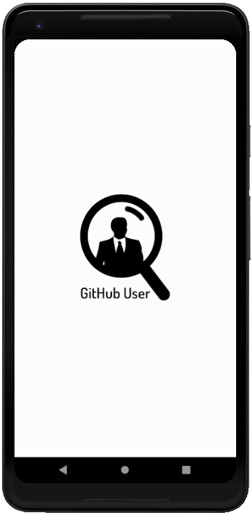
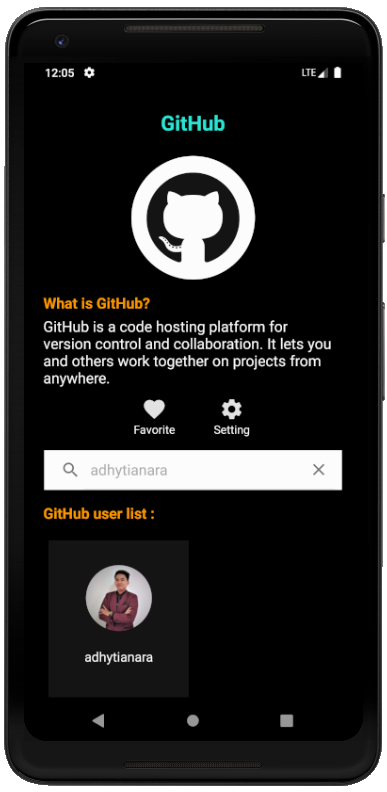

# Belajar Fundamental Aplikasi Android
Kelas <a href="https://www.dicoding.com/academies/14"><b>Belajar Fundamental Aplikasi Android</b></a> dari <a href="https://www.dicoding.com/" ><b>Dicoding</b></a> merupakan bagian dari alur belajar <a href="https://www.dicoding.com/learningpaths/7" ><b>Android Developer Learning Path</b></a> yang mempersiapkan siswa untuk menjadi Android Developer berstandar global Google.
Dicoding sebagai satu-satunya Google Developers Authorized Training Partner di Indonesia telah melalui proses penyusunan kurikulum secara komprehensif. Semua modul telah diverifikasi langsung oleh Google untuk memastikan bahwa materi yang diajarkan relevan dan sesuai dengan kebutuhan industri digital saat ini.

### Materi yang dipelajari
- **Prinsip Dasar Android** : Mempelajari dasar-dasar pemrograman Android yang wajib diketahui, seperti Activity, Fragment, macam-macam Intent, dan ListView.
- **UI dan UX Aplikasi** : Mempelajari cara mendesain aplikasi yang menarik dengan menggunakan layout, style, theme, localization, CustomView dan RecyclerView. Selain itu juga mendalami komponen-komponen Material Design seperti ActionBar, NavigationDrawer, BottomNavigation, dan TabLayout.
- **Testing** : Mempelajari berbagai macam testing, yaitu Unit Testing dan Instrumentation Testing.
- **Background Process** : Mendalami cara mengeksekusi suatu task di background thread, seperti  Service, Broadcast Receiver, AlarmManager, JobScheduler, dan WorkManager. Di sini juga belajar mengambil data dari restful API yang berformat JSON.
- **Local Data Storage** : Menjelaskan macam-macam cara untuk menyimpan data di Android seperti File, SharedPreference, database SQLite.
- **Extended Application** : Materi tambahan yang sangat berguna untuk mengembangkan aplikasi, seperti cara membuat Widget, Notification, Firebase Cloud Messaging (FCM), WebView, SoundPool, dan MediaPlayer.
- **Proyek Akhir** : Pembuatan aplikasi katalog dengan berbagai fitur seperti widget dan reminder.

### Submission
Membuat aplikasi Github User yang menampilkan daftar pengguna dari github dengan beberapa ketentuan yang diberikan, yaitu :
* **List User**
  * Menampilkan data pada halaman aplikasi. Data diperoleh melalui GitHub REST API. 
  * Menggunakan RecyclerView  untuk menampilkan data.

* **Detail User**
  * Terdapat informasi detail dari seorang user. 
  * Menampilkan fragment List Follower & List Following yang diambil dari API.
  * Menggunakan TabLayout sebagai navigasi antara halaman List Follower dan List Following.

* **Search User**
  * Pencarian user menggunakan data dari API berjalan dengan baik.
  * Pengguna dapat melihat halaman detail dari hasil daftar pencarian.
  * Data list user yang ditampilkan menggunakan RecyclerView.
  * List Item untuk RecyclerView disusun menggunakan ConstraintLayout.

* **Favorite User**
  * Aplikasi harus bisa menambah dan menghapus user dari daftar favorite.
  * Aplikasi harus mempunyai halaman yang menampilkan daftar favorite.
  * Menampilkan halaman detail dari daftar favorite.

* **Reminder**
  * Terdapat pengaturan untuk menghidupkan dan mematikan reminder di halaman Setting.
  * Daily reminder untuk kembali ke aplikasi yang berjalan pada pukul 09.00 AM.
  
* **Consumer App**
  * Membuat module baru yang menampilkan daftar user favorite.
  * Menggunakan Content Provider sebagai mekanisme untuk mengakses data dari satu aplikasi ke aplikasi lain.

* Menggunakan Parcelable sebagai interface dari obyek data yang akan dikirimkan antar Activity.
* Splash screen yang sesuai dengan tema aplikasi.
* Menambahkan Stack Widget untuk menampilkan daftar user favorite.
* Menggunakan library pihak ketiga seperti Retrofit.
* Menerapkan design pattern seperti MVVM.
* Terdapat indikator loading saat aplikasi memuat data.
* Aplikasi memberikan pesan eror jika data tidak berhasil ditampilkan.

### Screenshots
#### Main app

#### Consumer app

  
