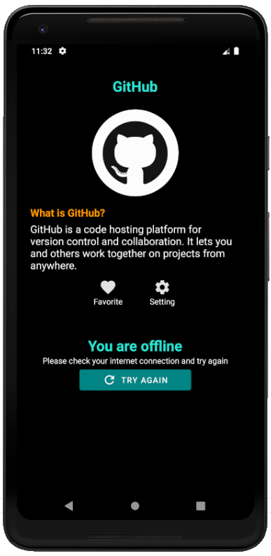
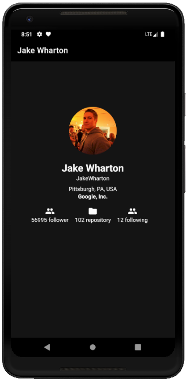

# Submission 1 Belajar Fundamental Aplikasi Android
### Kriteria Submission
Fitur yang ada pada aplikasi:
* **List User**
  * Menampilkan data pada halaman aplikasi dengan minimal jumlah 10 item.
  * Menggunakan RecyclerView  untuk menampilkan data.

* **Detail User**
  * Terdapat informasi detail dari seorang user. 
  
* Menggunakan Parcelable sebagai interface dari obyek data yang akan dikirimkan antar Activity.
* Splash screen yang sesuai dengan tema aplikasi.

### Screenshots

