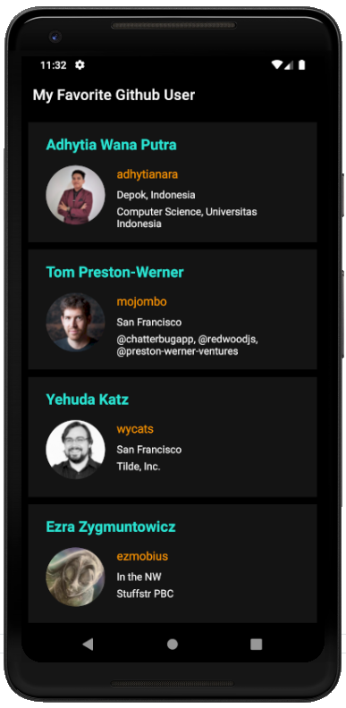
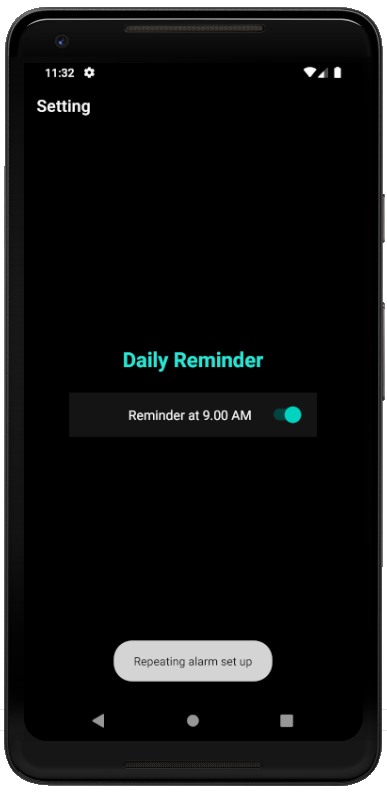
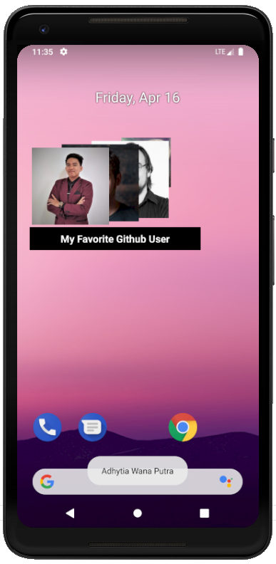
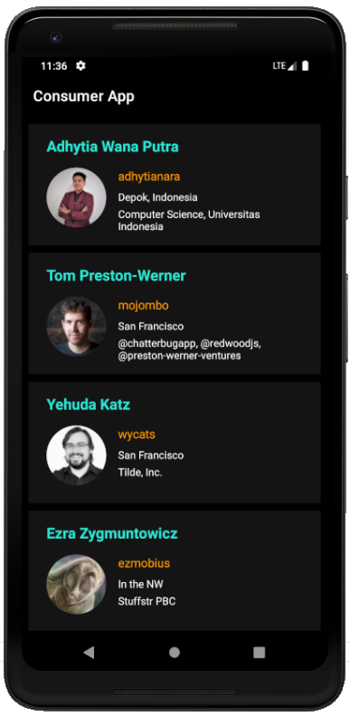

# Proyek Akhir Belajar Fundamental Aplikasi Android
### Kriteria Submission
Fitur yang ditambahkan pada aplikasi:
* **Favorite User**
  * Aplikasi harus bisa menambah dan menghapus user dari daftar favorite.
  * Aplikasi harus mempunyai halaman yang menampilkan daftar favorite.
  * Menampilkan halaman detail dari daftar favorite.

* **Reminder**
  * Terdapat pengaturan untuk menghidupkan dan mematikan reminder di halaman Setting.
  * Daily reminder untuk kembali ke aplikasi yang berjalan pada pukul 09.00 AM.
  
* **Consumer App**
  * Membuat module baru yang menampilkan daftar user favorite.
  * Menggunakan Content Provider sebagai mekanisme untuk mengakses data dari satu aplikasi ke aplikasi lain.
  
* Aplikasi memberikan pesan eror jika data tidak berhasil ditampilkan.
* Menambahkan Stack Widget untuk menampilkan daftar user favorite.

### Screenshots
#### Main app

#### Consumer app

