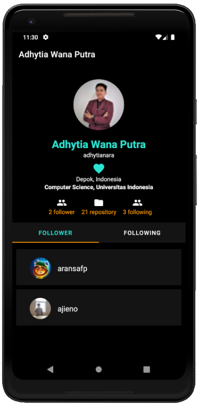

# Submission 2 Belajar Fundamental Aplikasi Android
### Kriteria Submission
Fitur yang ada pada aplikasi:
* **Search User**
  * Pencarian user menggunakan data dari API berjalan dengan baik.
  * Pengguna dapat melihat halaman detail dari hasil daftar pencarian.
  * Data list user yang ditampilkan menggunakan RecyclerView.
  * List Item untuk RecyclerView disusun menggunakan ConstraintLayout.

* **Detail User**
  * Mempertahankan fitur informasi user (User Details) yang sudah ditampilkan pada Submission 1.
  * Menampilkan fragment List Follower & List Following yang diambil dari API.
  * Menggunakan TabLayout sebagai navigasi antara halaman List Follower dan List Following.
  
* Menggunakan library pihak ketiga seperti Retrofit.
* Menerapkan design pattern seperti MVVM.
* Terdapat indikator loading saat aplikasi memuat data.
* Menggunakan SearchView pada fitur pencarian.

### Screenshots

